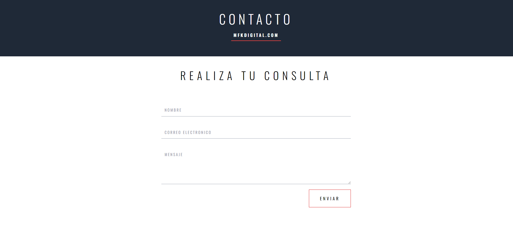

# Contact Form using React Hook Form + EmailJS

Link https://form-react-hook-form.vercel.app/

# Dependencies

- EmailJS: 3.11.0
- React-Hook-Form: 7.46.1
- React-Loader_spinner: 5.4.5 

# Diferent states of the form

# Form sent

- The form will make the relevant checks, then if all the fields are valid, it will send an email, an email will automatically be sent to the origin notifying that the query was received correctly.

